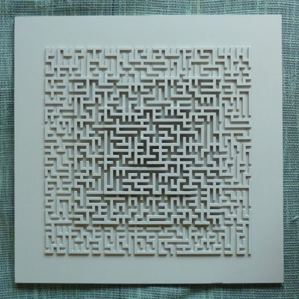

# MazeGen

A C++ program for generating mazes in SVG.
Program to experiment with various maze generation
algorithms. Program has no command line options.

## Pyramid Maze

The pyramid maze shown in the picture was given to me as
[a father day present](https://www.iwriteiam.nl/D2006.html#21) and made
with a laser cutter using SVG files by a run of the program of commit
[58a7bf3](https://github.com/FransFaase/MazeGen/commit/58a7bf3e3b6585fec07357913ff59156d9badd4d).
